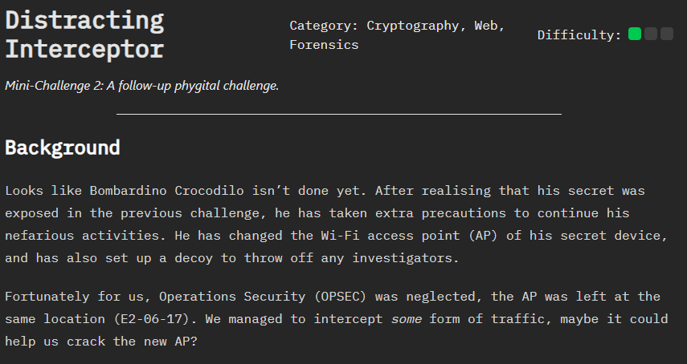
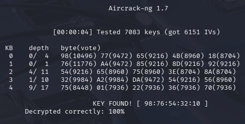

# Distracting Interceptor - SIT CYBERH4TS 2026 Mini Challenge 2

## Category & Difficulty 
Cryptography, Web, Forensics

## Overview

This challenge continues the scenario involving Bombardino Crocodilo. After his activities were exposed previously, he attempted to improve his operational security by changing the Wi-Fi access point (AP) used by his device and deploying a decoy to mislead investigators.

However, the device remained at the same physical location allowing us to intercept wireless traffic from the area. The goal of this challenge is to analyze the captured traffic and determine whether it reveals information about the new access point.

## Methodology
### 1. Initial Analysis of the Capture File
The challenge provided a .cap file alongside the problem statement. I began by opening the capture file in Wireshark to inspect the intercepted wireless traffic.

Based on the challenge description, I suspected that the goal might involve recovering the Wi-Fi access point credentials or analyzing the captured traffic to gain access to the network.
### 2. Searching for WPA Handshakes
My first step was to check whether the capture contained a WPA handshake, which would allow the network password to be cracked using standard tools.

I applied the following filter in Wireshark: eapol

However, no packets were returned, indicating that a WPA handshake was not present in the capture.
### 3. Identifying the Encryption Type
Next, I examined the Beacon frames in the capture to determine the security configuration of the wireless network.

Within the IEEE 802.11 parameters, I noticed the following:

  - RSN (Robust Security Network) field was not present
  - Privacy bit was set

This combination indicates that the access point was using WEP encryption rather than WPA/WPA2.

### 4. Recovering the WEP Key
Under the IEEE 802.11 packet details, I observed that the captured traffic contained WEP-encrypted frames. Since the capture contained approximately 15,000 packets, this was sufficient for performing a WEP key recovery attack.

I exported the capture file and used aircrack-ng in Kali Linux to recover the encryption key.

After running the tool, the WEP key was successfully recovered.

### 5. Decrypting the Wireless Traffic
Using the recovered key, I configured Wireshark to decrypt the WEP traffic. This allowed me to view the previously encrypted packets.

Initially, I suspected that the flag might be embedded somewhere within the decrypted network traffic.

To investigate further, I filtered the capture for common application protocols, including:

  - HTTP
  - FTP
  - Telnet
  - DNS

Despite inspecting the traffic, I was unable to locate any useful information or the flag itself.
### 6. Investigating the Physical Clue
Re-examining the challenge description, I noticed that it referenced a "phygital" challenge, implying a combination of physical and digital elements.

Additionally, the IP addresses observed in the capture were private addresses, suggesting that the device might still be accessible locally.

Based on this clue, I proceeded to the physical lab location mentioned in the challenge and attempted to connect to the recovered wireless access point.
### 7. Accessing the Device Interface
After locating a suitable position with sufficient signal strength, I successfully connected to the access point and navigated to the IP address that appeared frequently in the captured traffic.

This led to a login page requesting a username and password.

Upon further inspection of the website, I noticed that the application consisted of only a single index page, suggesting that it might be a decoy interface.
### 8. Inspecting the Webpage Source
I examined the page source and discovered the following JavaScript code:

`document.getElementById("m").textContent = atob(
    "==ARFlkTFREITNVRDNUQ".split("").reverse().join("")
);`

This code reverses a Base64 string before decoding it. After evaluating the script, the decoded message produced:

`ACCESS DENIED`

This confirmed that the login page was a fake interface designed to mislead investigators.
### 9. Investigating the Audio File
While examining the page further, I noticed a suspicious audio file link highlighted at the bottom of the page.

After downloading the file, I initially suspected that it contained Morse code, as the audio consisted of a series of short beeping sounds. However, attempts to decode the audio using online Morse code tools were unsuccessful.
### 10. Spectrogram Analysis
As an alternative approach, I opened the audio file in Audacity and switched to Spectrogram view.

The spectrogram revealed a hidden visual message embedded within the audio, which displayed an IP address along with a specific path.

### 11. Retrieving the Flag

Using the IP address and path revealed in the spectrogram, I navigated to the location while connected to the access point.

Accessing the endpoint revealed the flag, completing the challenge.

## Defensive Perspective 
This challenge exposed several security weaknesses:
1. Weak Encryption (WEP) – Easily cracked
Recommendation: Use WPA2/WPA3 with strong passphrases; avoid WEP.

2. Static Physical Location – Allowed traffic interception
Recommendation: Rotate device locations or use additional authentication layers.

3. Leaky Decoy Interfaces & Media – Source code and audio contained clues
Recommendation: Ensure decoys and media do not reveal hidden data.

4. General OPSEC – Predictable patterns and exposed traffic made exploitation easier
Recommendation: Rotate credentials, segment networks, and limit public exposure.

