# LPE Playground - SIT CYBERH4TS 2026 Mini Challenge 3

## Category
Pwn, Miscellaneous

## Overview
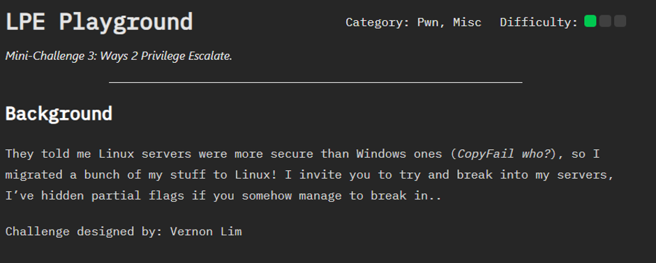
It is a multi-stage challenge focused on Linux Privilege Escalation techniques. The challenge consists of four stages, each requiring participants to identify and exploit a different privilege escalation path in order to obtain a partial flag.
According to the challenge description, flags are located at /root/flag.txt unless stated otherwise. The objective is to successfully complete all four stages and recover every partial flag, which can then be combined to solve the overall challenge.

This write-up documents the methodology, tools, and techniques used to solve each stage.

## Methodology & Exploitation
### Stage 1 - Superuser 
I began by logging in as the provided user, ctf_user, and performing basic enumeration of the home directory. I observed several hidden files, including a file named .hint. Attempting to read the file using less resulted in a "command not found" error, so I used cat instead. 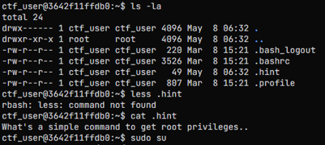

The hint suggested that the user might have unrestricted sudo privileges. I attempted to switch to the root account using: sudo su. After obtaining root access, I navigated to the /root directory and retrieved the first partial flag.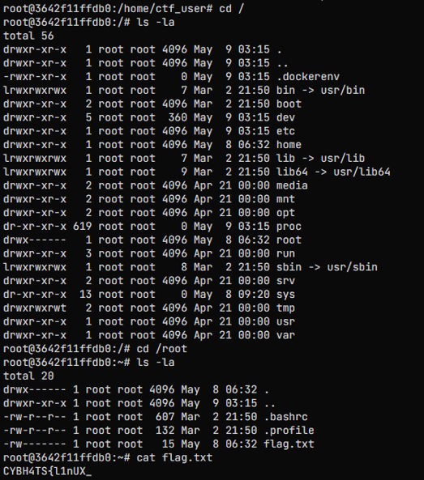

### Stage 2 - Lockdown
Upon accessing Stage 2, I found myself in a restricted Bash environment. As I was unfamiliar with the limitations imposed by the shell, I began by reviewing the available commands using the built-in help functionality. After enumerating the environment, I used ls to inspect the current directory and discovered a file named flag.txt.

Although the flag file was visible, common utilities such as cat were unavailable within the restricted shell, preventing me from reading the file directly.To work around this restriction, I leveraged the find command's -exec functionality to execute cat on the discovered file. 

The command successfully displayed the contents of flag.txt, revealing the second partial flag. This demonstrated that while direct access to certain commands was restricted, other available utilities could still be abused to achieve the same result.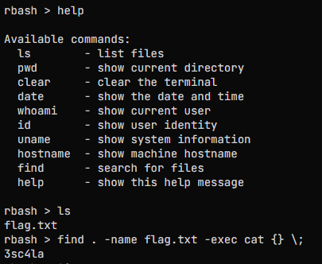

### Stage 3 - Writable Dependency Hijacking
After logging in, I performed basic enumeration. Among the files in the home directory was a text file containing the following message. 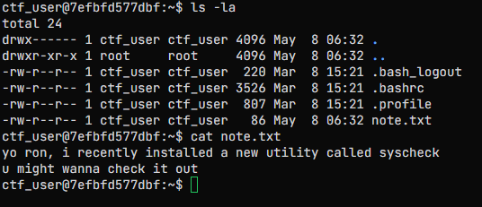

This suggested that the custom utility syscheck was likely the intended attack surface. To investigate further, I examined the binary located at /usr/local/bin/syscheck. Viewing the beginning of the file confirmed that it was an ELF executable. During inspection, I also noticed references to a string named service_status, indicating that the binary likely depended on another executable.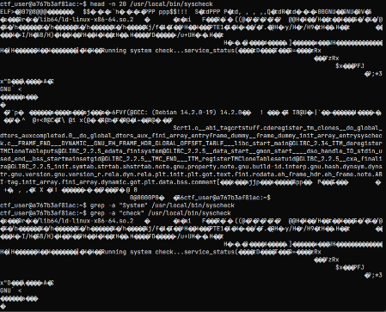

Since the binary was owned by root and not directly executable by my user, I leveraged the same technique used in Stage 2 to execute it through find. The binary executed successfully and returned: Running system check ... System works!

At this stage, I considered several possible attack vectors, including PATH hijacking, environment variable manipulation, and configuration abuse. However, none of these approaches yielded useful results.

Returning to the binary inspection results, I focused on the previously discovered service_status reference. Further enumeration revealed the file: /usr/local/bin/service_status. Inspecting its permissions showed that it was world-writable. 

This meant any user could modify the executable despite it being owned by root. To exploit this, I replaced the contents of service_status with a script that would spawn a privileged shell. I then executed syscheck again. Since the binary relied on service_status, my malicious replacement was executed instead, resulting in a root shell.

With root access obtained, I navigated to the /root directory and retrieved the third partial flag.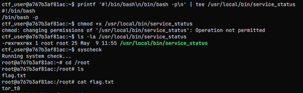

### Stage 4 - Routine 
Upon accessing Stage 4, I found a note indicating that a utility was being executed automatically every minute. This immediately suggested that the challenge might involve a scheduled task, such as a cron job, running with elevated privileges.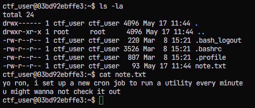

My initial approach was to enumerate the system's cron configuration. However, due to the restrictions imposed by rbash, many common enumeration techniques were unavailable, preventing direct inspection of cron-related files and commands. 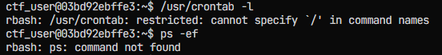

While investigating the environment, I discovered a utility named sysmon. Executing the program manually produced the following message: Executing userscript... This indicated that the utility was likely reading and executing commands from a user-controlled file.

Further investigation revealed that sysmon was reading commands from a file named .monitor_cmd located in the user's home directory. Since output redirection (>) was blocked by rbash, I used tee to write commands into the file. Although the scheduled task executed the command, direct attempts to copy the flag file were unsuccessful due to additional restrictions within the challenge environment.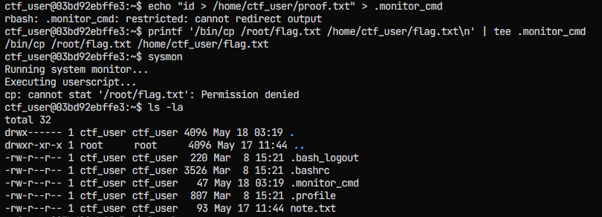

To work around this limitation, I used a payload that encoded the flag and wrote the output to a location accessible by the current user.When the scheduled task executed as root, it processed the payload and created the encoded output file. After retrieving and decoding the contents of flag.b64, I obtained the final partial flag required to complete the challenge.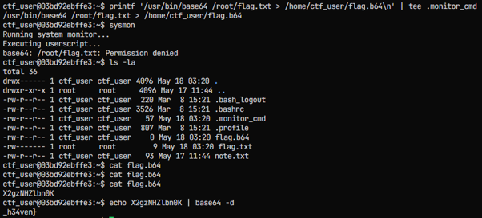

## Defensive Perspective
This challenge demonstrates several common Linux privilege escalation misconfigurations:

1. Excessive Sudo Privileges
Granting unrestricted sudo access allows users to obtain root privileges with minimal effort. Permissions should follow the principle of least privilege.

2. Weak Restricted Shell Implementations
Restricting individual commands is often insufficient when allowed utilities can execute arbitrary commands on behalf of the user.

3. Insecure File Permissions
World-writable files used by privileged applications can be modified by untrusted users and abused for privilege escalation.

4. Unsafe Scheduled Tasks
Automated processes running with elevated privileges should never execute user-controlled input without proper validation and access controls.

Overall, the challenge highlights how privilege escalation often arises from misconfigurations rather than software vulnerabilities. Proper permission management, secure configuration practices, and regular security reviews can significantly reduce the risk of these attacks.
